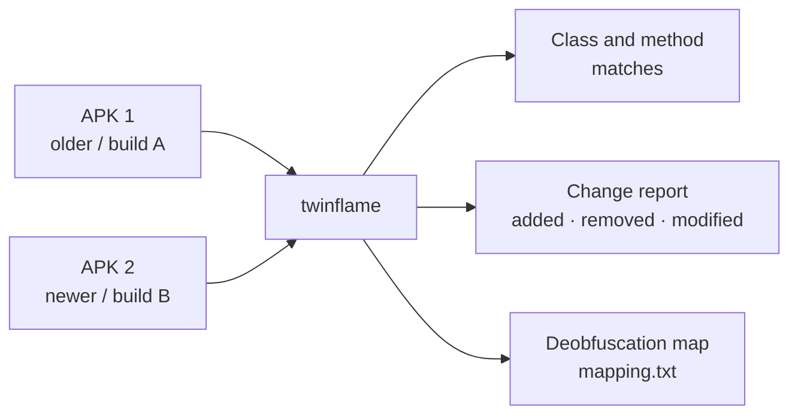
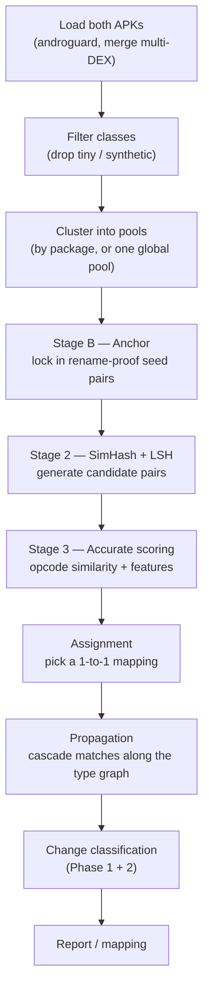
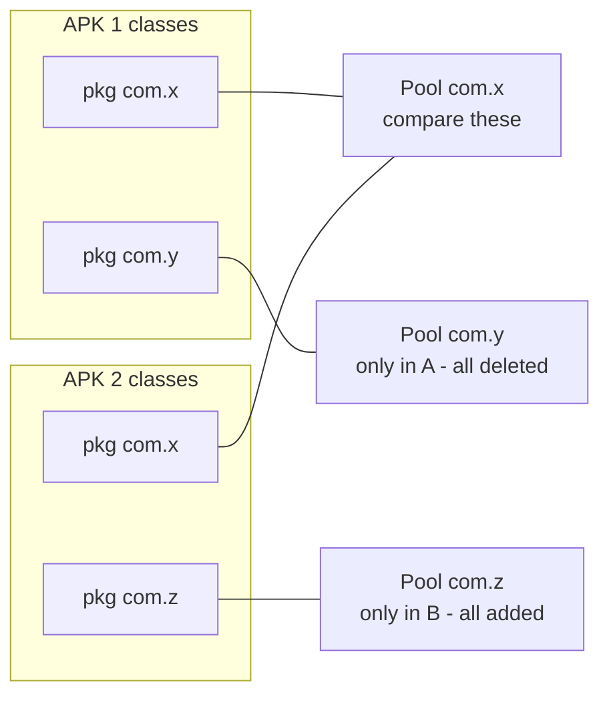
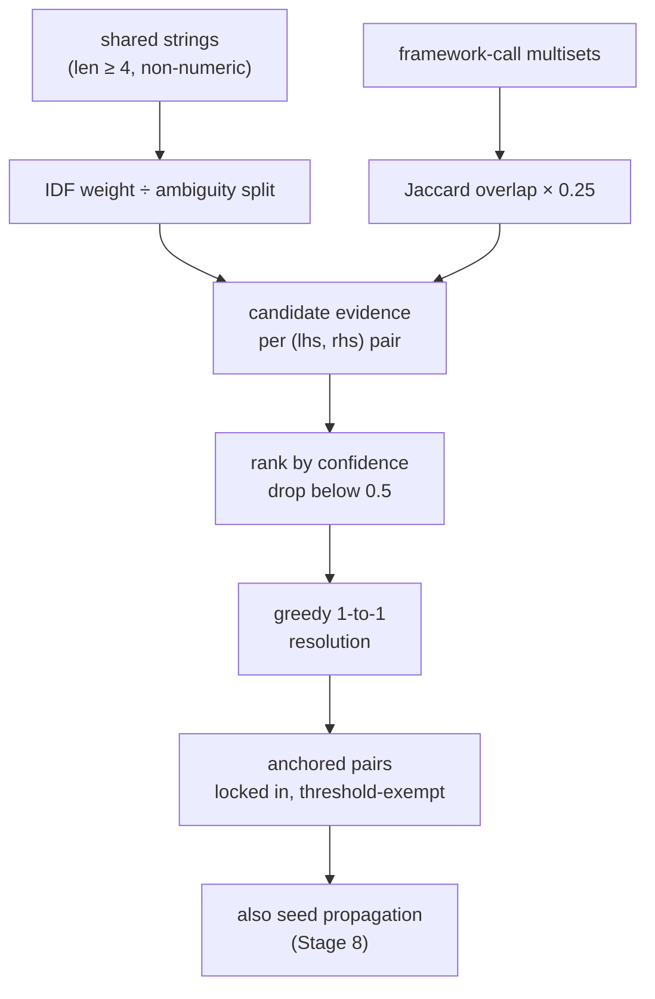
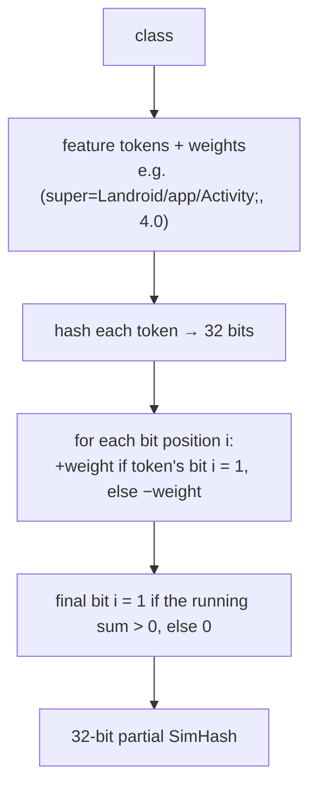
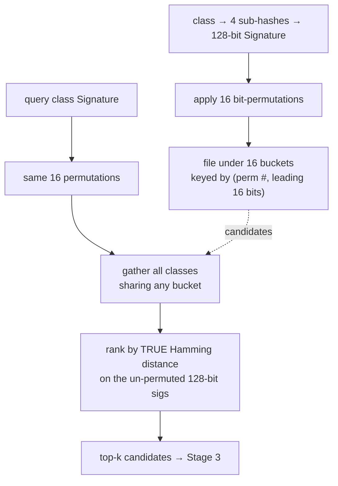
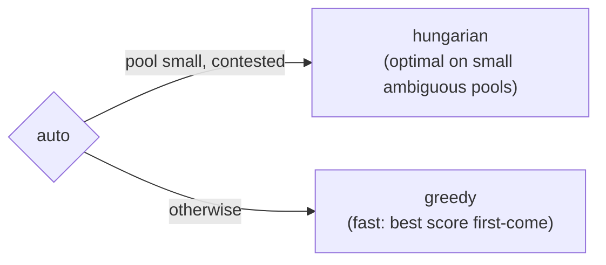
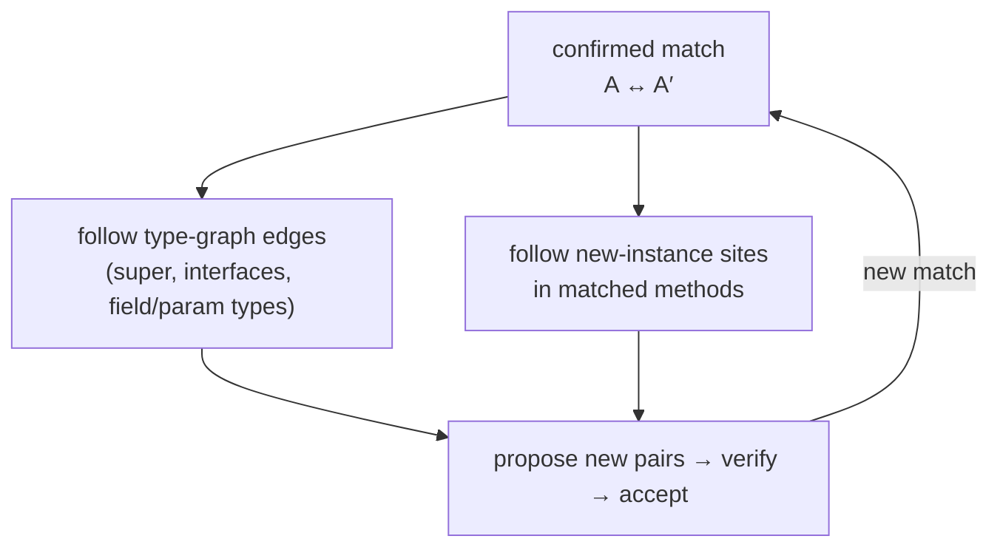
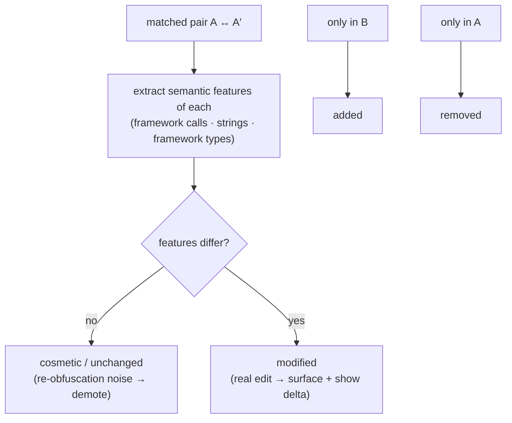
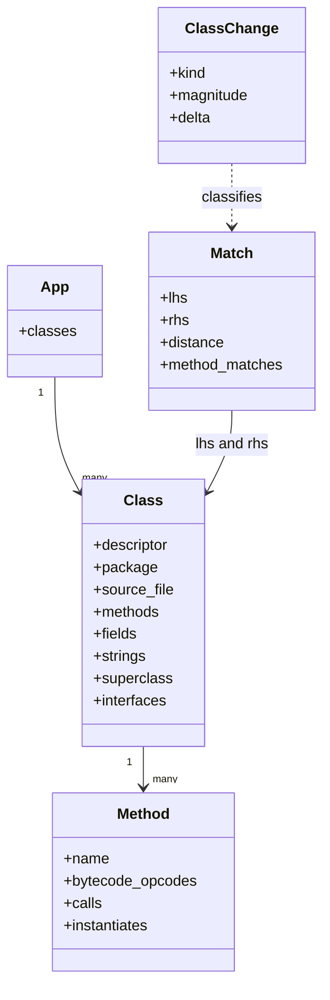

# How twinflame works

A plain-language walkthrough of what happens when you diff two Android apps. No prior
knowledge of the code assumed. Diagrams are [Mermaid](https://mermaid.js.org/) — GitHub and
most Markdown viewers render them inline.

## The problem in one sentence

Android release builds are run through **R8/ProGuard**, which renames every class and method
to short meaningless names (`com.example.PaymentService` → `a.b.c`), flattens packages, and
inlines/optimizes code. So you can't line up "the same class" across two builds by name —
twinflame lines them up by **what the code *is and does*** instead.

## What it produces



Three things a user can ask for, all built on the same matching core:

| Use case | Question | Output |
|---|---|---|
| **Version diff (UC1)** | What changed between v1 and v2 of my app? | Change report |
| **Sample kinship (UC2)** | Do these two (malware) samples share code? | Ranked similar-pairs |
| **Name recovery (UC3)** | What were the original class/method names? | `mapping.txt` |

---

## The pipeline, end to end



The first four stages (load → cluster → anchor → SimHash/LSH → accurate) are the **Quarkslab
four-stage architecture**; propagation and change classification are twinflame's additions.
Each stage narrows the problem so the expensive work only runs where it's needed.

---

## Stage by stage

### 1. Load
`loader.py` uses **androguard** to parse the DEX bytecode inside each APK, merges multiple
`classes*.dex` files into one class list, and captures, per class: its methods (with raw
opcodes), fields, string constants, superclass/interfaces, and — per method — which other
methods it **calls** and which classes it **instantiates**. These last two are the raw
material for the rename-proof signals used later.

### 2. Filter
`api._apply_filters` drops classes that add noise without value: compiler-generated synthetic
classes, and classes with fewer than `min_inst_size_threshold` (default 2) total instructions
(empty marker/interface shells).

### 3. Cluster into pools
`cluster.py` groups classes into **pools** so matching only compares classes likely to
correspond, instead of every-class-against-every-class. By default it pools by package; when
the two sides don't share package names (obfuscated builds, or two different apps), you use
**one global pool** (`--no-cluster`). Only pools that have classes on *both* sides get compared.



### 4. Stage B — Anchoring (the rename-proof shortcut)
`anchor.py`. R8 can rename identifiers but it **cannot** rewrite the *content* of a string
constant or the *target* of a framework API call (`android/*`, `androidx/*`, `java/*`,
`javax/*`, `kotlin/*`, `kotlinx/*`). Two classes that share a rare string (a unique log tag,
URL, error message) or call the same distinctive set of framework APIs are almost certainly the
same class. These string and framework-call signals are the **hooks**: fixed points that
survive renaming and let the two builds be pinned together before any structural guessing.
Anchoring turns them into **high-confidence seed pairs** that are locked in *first*.

**How a hook earns confidence (string-IDF).** Not every shared string is worth the same. A
string's evidence is weighted by **IDF** (inverse document frequency): a string that appears in
exactly *one* class on each side is a near-certain fingerprint and contributes ~1.0; a string
that appears in dozens of classes (a common word, a framework constant) is down-weighted by how
many classes hold it, and further **split** across every candidate pair it could link
(`tok_idf / (lhs_df × #rhs_matches)`) so an ambiguous string can't manufacture a false anchor.
A class's total evidence for a given partner is the sum over all their shared strings.

**Framework calls disambiguate, they don't mint.** Once string evidence has proposed candidate
pairs, the **Jaccard overlap of their framework-call multisets** adds a small nudge
(`FRAMEWORK_WEIGHT = 0.25`) — enough to break ties between two string-plausible partners, not
enough to anchor on its own (a shared `Log.d` call is far too common).

**Resolution and what "locked in" means.** Candidates are ranked by confidence and resolved
**greedily 1-to-1**; a pair below `min_confidence` (0.5) is dropped. Surviving anchors are then
handed to the matcher marked `{"anchored": 1.0}` and are **kept unconditionally** — they bypass
the `--threshold` gate that structural pairs must clear. That is the whole point: a class whose
*body* was heavily rewritten between versions (so its structural score would fall below
threshold and it would be misreported as deleted+added) is still correctly paired because its
hook — a unique URL, a distinctive API sequence — didn't move.



**Why anchors matter most for UC2 (malware kinship).** When two samples share original code
but scramble package names *and* re-randomize obfuscated strings, the string hooks may be gone —
but the framework-call hooks (which APIs each method invokes, in what proportion) survive,
because you can't rename `android/telephony/SmsManager`. That residual hook is what keeps
kinship detectable after the data has been scrambled.

### 5. Stage 2 — SimHash + LSH (find candidates fast)
`signature.py`. Comparing every remaining class against every other is too slow, so each class
is boiled down to a **128-bit fingerprint** — and, crucially, a fingerprint where *similar
classes get similar bits*. That's what a **SimHash** buys you over a cryptographic hash: flip
one input feature and only a few output bits change, so two builds of the same class land a
short **Hamming distance** apart instead of looking totally unrelated.

#### 5a. How a SimHash is built

Every class is first turned into a **bag of weighted feature tokens** — short strings like
`nmethods=7`, `op=INVOKE`, `super=Landroid/app/Activity;`, each with a numeric weight saying how
much it should count. The fingerprint is then computed like a weighted vote, one vote per bit:



Concretely (`_simhash`): each token is hashed to 32 bits with BLAKE2b; for bit position *i*, a
token adds `+weight` if its hash has bit *i* set and `−weight` otherwise. After all tokens, each
output bit is `1` where its accumulator finished positive. So a bit is decided by the *weighted
majority* of the features that touch it — one heavy feature can outvote several light ones, and
adding/removing a light feature rarely flips a bit. A class with **no** features hashes to 0.

#### 5b. Four sub-signatures, not one

A class isn't hashed as a single blob — it produces **four independent 32-bit SimHashes** that
are concatenated into the 128-bit `Signature`. This keeps a change in one facet from smearing
across the others (a class that gains fields but keeps its code still matches on the `code`
quarter):

| Sub-hash | Built from | Notable weights |
|---|---|---|
| `cls` | method count, field count, access flags, **framework** super/interfaces | `super=` **4.0**, `iface=` **3.0**, rest 1.0 |
| `fld` | per field: type descriptor, static-or-not | 1.0 each |
| `mth` | per method: arg count, return type, xref count | `log2(2 + instr_count)` |
| `code` | per method: opcode-category mix, **framework call targets** | opcodes `log2(2+n)`; `call=` ×**3.0** |

Two weighting decisions carry most of the accuracy:

- **Framework invariants are weighted heavily above structural features.** A framework
  superclass (`4.0`), interface (`3.0`), or call target (`3×` the opcode weight) survives R8
  rename *and* optimization **verbatim on both sides** of an obfuscated pair, whereas counts and
  opcode mix drift. Only ~13 distinct opcode categories exist, so on a small class they saturate
  the signature; without the heavy thumb on the scale the rename-proof signal wouldn't move
  enough bits to bucket true pairs together. (This weighting is exactly the fix for the
  diagnosed "84% of true pairs never surfaced" gap — see `eval/corpus/README.md`.)
- **Bigger methods vote louder.** Per-method features are weighted by `log2(2 + instr_count)`,
  so a 200-instruction method influences the fingerprint more than a one-line getter — but only
  logarithmically, so a single huge method can't drown everything else out.

Note the **overlap with anchoring by design**: the same framework calls/types that anchor
classes (Stage B) are *also* folded into the SimHash here. Anchoring uses them as exact-match
hooks for a few high-confidence pairs; SimHash uses them as *fuzzy* signal to bucket the rest.

#### 5c. LSH — bucketing so near-matches collide

Even with fingerprints, comparing every fingerprint to every other is still O(N²).
**LSH** (Locality-Sensitive Hashing) avoids it: it arranges buckets so that *near* fingerprints
tend to fall in the *same* bucket, and a query then only scores the handful of classes sharing
its buckets.

The trick (`LSHIndex`) is **bit permutations**. It generates `n_permutations` (default 16) fixed
random shufflings of the 128 bit positions — seeded, so both APKs use the identical set. For
each permutation it reorders a fingerprint's bits and takes the **leading 16 bits** as a bucket
key `(permutation_index, prefix)`. A class is filed under all 16 of its prefixes.

Why permutations work: two near-neighbors differ in only a few bits. If those few differing bits
happen to fall inside the 16-bit prefix, the pair misses that bucket — but across 16 *different*
random permutations, the differing bits stay **out** of the prefix in at least one permutation
with high probability, so the true pair still collides *somewhere*. More permutations = higher
recall at more memory/time.



On lookup, buckets only *propose* candidates; the actual ranking uses the **true Hamming
distance** between the original (un-permuted) 128-bit signatures, and the top *k* (default 3)
go to accurate scoring. An optional **multi-probe** setting also checks buckets a bit or two away
from the query's prefix to recover neighbors that just missed — measured to add nothing at 16
permutations, so it's **off by default** and only pays off when permutations are deliberately few.

### 6. Stage 3 — Accurate scoring
`accurate.py`. For each surviving candidate pair, compute a real similarity in [0,1]:
- **Abstract-opcode Levenshtein** — each method's opcodes are mapped to ~13 *categories*
  (so register renumbering doesn't matter), and the edit distance between the two classes'
  category streams is the dominant term.
- **Structural features** — method/field-count ratios, access-flag / field-type / method-proto
  agreement.

Methods inside a paired class are themselves matched 1-to-1, yielding per-method verdicts
(`matched` / `modified` / `added` / `deleted`) that feed the class score and the reports.

### 7. Assignment (resolve to 1-to-1)
Each left-hand class may have several candidate right-hand matches. `select_assignment` turns
those candidate lists into a clean one-to-one mapping:



A structural pair is only kept if its score clears the `--threshold` (default 0.8); otherwise
the classes are reported as deleted/added rather than a low-confidence match. Anchored pairs
(Stage B) are always kept.

### 8. Propagation (matches beget matches)
`propagate.py`. Once two classes are confirmed matched, more matches follow *for free* from
the **type graph**, with no extra LSH cost:
- **Declared-type cascade (M1.3):** if matched classes A↔A′ have superclass X↔X′ or reference
  types by field/parameter, those referenced classes are strong candidates too.
- **Call-site anchor (M1.4):** if matched method M↔M′ both do `new-instance` at the same
  position, the instantiated classes correspond — even tiny classes with no fingerprintable
  content (Kotlin lambdas, `Companion` objects) get matched by *where they're created*.



This repeats to a fixpoint (a new match can trigger further matches).

---

## Change classification (the "what changed" layer)

Matching tells you *which* class in build A is which in build B. But the structural score is a
poor *change* signal: two builds of the **same** source still look different after R8 re-runs
(different inlining, renaming). So change detection uses a different rule:

> **Match on similarity; classify change on *semantic-feature deltas*.**



- **Phase 1 (`features.py`)** extracts the *obfuscation-robust* content whose change is a
  real edit: the set of **framework/library calls**, **string constants**, and **framework
  type references** — all of which stay comparable across two obfuscated builds without a name
  map. `class_change(A, A′)` returns exactly what was added/removed.
- **Phase 2 (`changes.py`)** turns each match into a typed verdict — `added` / `removed` /
  `modified` / `cosmetic` / `unchanged` — and **ranks** them most-review-worthy first
  (real edits by size of change, then added/removed, cosmetic/unchanged demoted). Output is
  machine-consumable JSON (with the exact per-class deltas) or a human triage summary.

The design intent (see `plans/change-detection-roadmap.md`): **demote, never drop** — every
class is emitted with a score and category so a reviewer/tool can filter; nothing is silently
hidden.

---

## The data flowing through it



---

## Running it

```bash
# Class/method match report
twinflame old.apk new.apk

# Two obfuscated builds (renamed packages won't align) → one global pool
twinflame old.apk new.apk --no-cluster

# Ranked semantic change report (default); machine-readable JSON written to a file
twinflame old.apk new.apk --no-cluster -o changes.json

# Recover original names into a ProGuard mapping.txt (feed to jadx/retrace)
twinflame old.apk new.apk --deobfuscation-map recovered.txt
```

## The one thing to remember

R8 fights matching in two ways: **renaming/repackaging** (defeated — anchoring on
strings/framework calls and structure sees through it) and **optimization/inlining** (the hard
part — it genuinely restructures code). Everything above is built to be robust to the first
and to degrade gracefully on the second, and to keep the *change* verdict resting on signals
that survive both.
